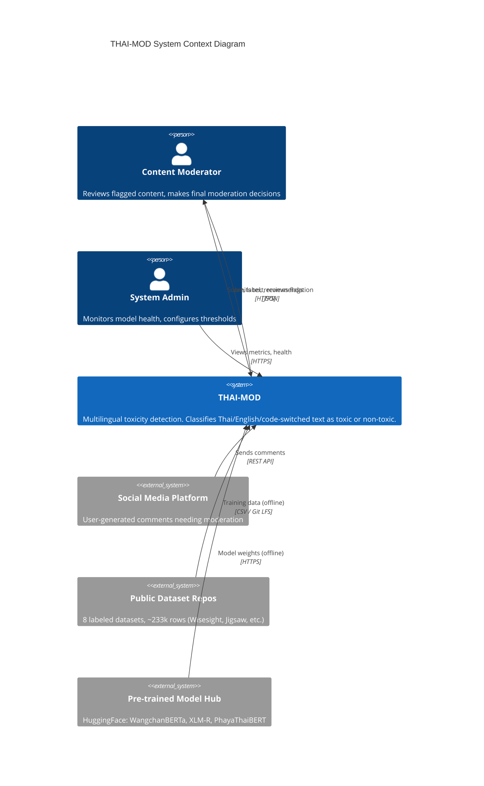

# C4 Level 1: System Context Diagram

> This diagram is shared across both v1 (Current) and v2 (Future) versions.
> The system boundary and external actors remain the same regardless of which model is deployed internally.

## Diagram

## Actor Descriptions

### Content Moderator (Primary User)
- The main user of the system
- Receives flagged comments with toxicity scores and recommendations
- Makes the **final decision** on whether to allow, remove, or escalate content
- The system is explicitly designed as **decision-support**, not automated enforcement
- Interacts through the Moderator Web UI at `/`

### System Administrator
- Monitors model health via `/api/health` and `/api/model-info`
- Views prediction metrics and cache status through the Admin UI at `/admin`
- In the future version (v2): manages authentication, reviews monitoring dashboards, triggers model retraining

### Social Media Platform (External)
- The upstream source of user-generated content
- Sends individual comments or batches to THAI-MOD's REST API for screening
- In the current prototype, this is simulated by manual input through the Moderator UI

### Public Dataset Repositories (External)
- 8 labeled datasets from academic and open-source sources
- Thai datasets (5): Wisesight Sentiment, Thai Toxicity Tweet, HateThaiSent, Thai Sentiment Analysis, Thai Cyberbullying LGBT
- English datasets (3): Jigsaw Toxic Comment, Hate Speech for Social Media, Hate Speech and Offensive Language
- Combined: ~233,931 rows pre-dedup, ~30,620 post-dedup
- Used offline during training phase only; not accessed at inference time

### Pre-trained Model Hub (External)
- Hugging Face Hub provides transformer weights
- Used offline during model fine-tuning; downloaded once and cached locally
- Current v1 does not use this at runtime (TF-IDF+LR has no pre-trained weights)
- Future v2 will load cached WangchanBERTa weights at startup

## Key Boundaries

| Boundary | Inside | Outside |
|---|---|---|
| System boundary | THAI-MOD API, Moderator UI, ML model, preprocessing pipeline | Social platforms, dataset repos, model hubs |
| Trust boundary | Moderator (authenticated in v2), Admin | External API consumers (unauthenticated in v1) |
| Data boundary | Processed text + predictions (ephemeral, no logging) | Raw user data stays on the originating platform |

## Privacy Notes
- THAI-MOD processes text in real-time and does **not** store user comments permanently
- No PII is collected or retained
- All training data comes from publicly available, anonymized datasets
- The system is designed as human-in-the-loop: it flags, it does not enforce
