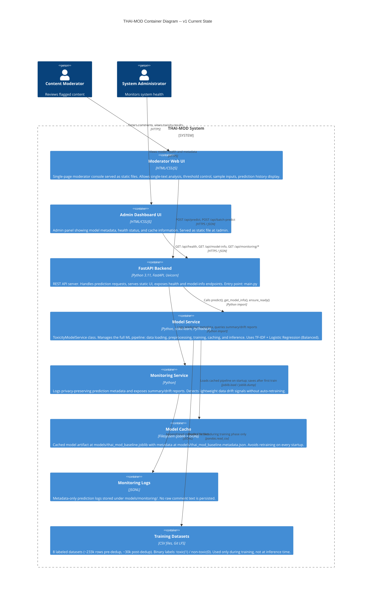

# C4 Level 2: Container Diagram -- v1 Current (LR Baseline)

> This represents the system as currently deployed.
> Model: TF-IDF + Logistic Regression (Balanced)
> No authentication and no BERT inference. Includes lightweight metadata-only monitoring.

## Diagram



## Container Descriptions

### Moderator Web UI
- **Location**: `src/thai_mod_api/static/index.html` + `app.js` + `styles.css`
- **Served at**: `GET /` (FileResponse)
- **Features**:
  - Text input box for single-message analysis
  - Adjustable toxicity threshold slider
  - Pre-loaded sample toxic and non-toxic inputs for demo
  - Result cards showing: predicted label, toxic score, confidence, threshold, recommendation
  - Recent prediction history panel
- **Technology**: Vanilla HTML/CSS/JS, no framework, no build step
- **Communication**: Calls FastAPI backend via `fetch()` to `/api/predict`

### Admin Dashboard UI
- **Location**: `src/thai_mod_api/static/admin.html` + `admin.js`
- **Served at**: `GET /admin` (FileResponse)
- **Features**:
  - Model health status display
  - Model metadata (name, deployment mode, training date, dataset info)
  - Cache status indicator
  - Evaluation metrics display (accuracy, precision, recall, F1, F2, confusion matrix)
- **Note (v1)**: No authentication -- admin route is publicly accessible

### FastAPI Backend
- **Location**: `src/thai_mod_api/main.py`
- **Framework**: FastAPI with Uvicorn ASGI server
- **Endpoints**:

| Method | Path | Purpose |
|---|---|---|
| GET | `/` | Serve Moderator UI |
| GET | `/admin` | Serve Admin Dashboard |
| GET | `/api/health` | Health check: status, model_loaded, model_name, deployment_mode, cache_status |
| GET | `/api/model-info` | Full model metadata including metrics |
| GET | `/api/monitoring/summary` | Aggregated prediction metadata summary |
| GET | `/api/monitoring/drift` | Lightweight data drift status and check details |
| POST | `/api/predict` | Single text prediction |
| POST | `/api/batch-predict` | Batch prediction (up to 100 texts) |

- **Middleware**: CORS (allow all origins -- open for development)
- **Lifespan**: On startup, calls `model_service.ensure_ready()` to load or train the model
- **Request/Response schemas**: Defined in `schemas.py` using Pydantic

### Monitoring Service
- **Location**: `src/thai_mod_api/monitoring_service.py`
- **Stored data**: timestamp, toxic score, predicted label, confidence, threshold, processed text length, language type, source model
- **Privacy rule**: Raw comment text is not stored
- **Drift checks**:
  - Toxic prediction rate shift
  - Average text length shift
  - Thai/English/mixed/other language distribution shift
  - Uncertain prediction rate, where toxic score is between 0.4 and 0.6
- **Behavior**: Reports `ok`, `warning`, or `insufficient_data`; retraining remains a human decision

### Model Service (ToxicityModelService)
- **Location**: `src/thai_mod_api/model_service.py`
- **Role**: The core ML component. Single class handling the entire pipeline:
  1. **Data loading**: Reads 8 CSV datasets, cleans, deduplicates, maps labels to binary
  2. **Preprocessing**: Shared `preprocess_text()` from `src/thai_mod_api/text_processing.py` performs NaN handling, URL removal, emoji demojization, and ASCII lowercasing
  3. **Feature extraction**: TF-IDF vectorization (unigram + bigram, PyThaiNLP tokenizer, max 20k features)
  4. **Training**: Logistic Regression with class_weight='balanced', 80/20 stratified split
  5. **Inference**: predict_proba -> threshold comparison -> recommendation
  6. **Caching**: Save/load trained pipeline as joblib artifact
- **Model**: `TF-IDF + Logistic Regression (Balanced)`
- **Default threshold**: 0.4 (tuned to favor recall over precision)

### Model Cache
- **Location**: `models/` directory (gitignored)
- **Files**:
  - `thai_mod_baseline.joblib` -- serialized scikit-learn Pipeline (TfidfVectorizer + LogisticRegression)
  - `thai_mod_baseline.metadata.json` -- training metadata (model name, timestamp, dataset info, evaluation metrics)
- **Behavior**:
  - First startup: trains from datasets, saves cache, reports `trained_and_cached`
  - Subsequent startups: loads from cache, reports `loaded_from_cache`
  - Atomic writes via `.tmp` files to prevent corruption

### Training Datasets
- **Location**: `datasets/dataset1.csv` through `dataset8.csv`
- **Tracking**: Git LFS (configured in `.gitattributes`)
- **Size**: ~233k rows raw, ~30k after deduplication
- **Schema**: Each CSV has at minimum `texts` (string) and `category` (label) columns
- **Label mapping**: `neg` -> toxic(1), `pos`/`neu` -> non-toxic(0)
- **Note**: Only used during training. Not accessed during inference.

## Data Flow: Single Prediction Request

```
Moderator -> [Web UI] -> POST /api/predict {"text": "...", "threshold": 0.4}
                            |
                     [FastAPI Backend]
                            |
                     model_service.predict(text, threshold)
                            |
                     [Model Service]
                        1. preprocess_text(text)
                           - remove URLs (regex)
                           - demojize emojis (emoji lib)
                           - lowercase English chars
                        2. pipeline.predict_proba([processed_text])
                           - TfidfVectorizer.transform (PyThaiNLP tokenize)
                           - LogisticRegression.predict_proba
                        3. toxic_score >= threshold?
                           - Yes: label="toxic", recommendation="FLAG_FOR_REVIEW"
                           - No:  label="non-toxic", recommendation="ALLOW"
                        4. monitoring_service.log_prediction(result)
                           - store metadata only, not raw text
                            |
                     Response: {
                       text, processed_text, predicted_label,
                       toxic_score, confidence, threshold,
                       recommendation, source_model
                     }
                            |
                     [Web UI] -> Display result cards
```

## Current Limitations (v1)

| Gap | Impact | Addressed in v2? |
|---|---|---|
| No authentication | Admin UI publicly accessible | Yes (P2) |
| No BERT inference | Lower accuracy on context-dependent toxicity | Yes (model swap) |
| Lightweight monitoring only | Drift detection is basic and metadata-only | Yes (P4 dashboard/statistical tests) |
| No automated tests | No regression safety net | Yes (P3) |
| CORS allow all | Not suitable for production | Yes (tighten in deployment) |
| No raw-text audit log | Cannot inspect exact production comments from logs | Intentional privacy trade-off |
