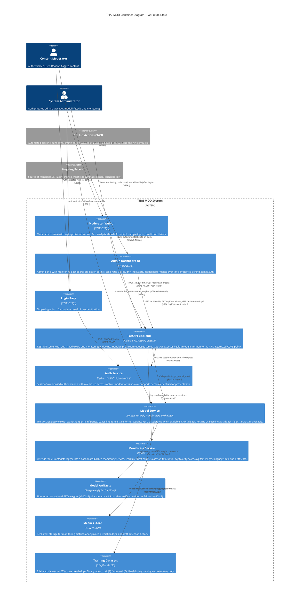

# C4 Level 2: Container Diagram -- v2 Future (WangchanBERTa + Auth + Monitoring)

> This represents the target architecture after full system upgrades.
> Model: WangchanBERTa (fine-tuned transformer)
> Includes: authentication, monitoring, automated tests, CI/CD pipeline.

## Diagram



## Container Descriptions

### Login Page
- **Served at**: `GET /login`
- **Features**: Username/password form, role selection (moderator/admin), error feedback
- **Flow**: On successful login, redirects to Moderator UI or Admin Dashboard based on role

### Auth Service
- **Responsibility**: Authentication and authorization
- **Method**: Session/token-based (lightweight, demo-friendly)
- **Roles**:
  - `moderator`: Access to Moderator UI and prediction endpoints
  - `admin`: Access to everything including monitoring endpoints
- **Demo credentials**: Pre-configured accounts for live presentation
- **Integration**: FastAPI middleware validates token on protected routes

### Moderator Web UI
- **Location**: `src/thai_mod_api/static/index.html` + `app.js` + `styles.css`
- **Served at**: `GET /` (requires authentication)
- **Features**:
  - Text input for single-message analysis
  - Adjustable toxicity threshold slider
  - Pre-loaded sample inputs for demo
  - Result cards: predicted label, toxic score, confidence, threshold, recommendation
  - Recent prediction history panel
- **Auth**: Sends auth token with every API call

### Admin Dashboard UI
- **Location**: `src/thai_mod_api/static/admin.html` + `admin.js`
- **Served at**: `GET /admin` (requires admin role)
- **Features**:
  - Model health status and metadata display
  - Evaluation metrics (accuracy, precision, recall, F1, F2, confusion matrix)
  - Monitoring dashboard:
    - Prediction count over time
    - Toxic/non-toxic ratio trend
    - Average toxicity score trend
    - Text length distribution
    - Data drift indicators

### FastAPI Backend
- **Location**: `src/thai_mod_api/main.py`
- **Framework**: FastAPI with Uvicorn ASGI server
- **Endpoints**:

| Method | Path | Purpose | Auth |
|---|---|---|---|
| GET | `/` | Serve Moderator UI | Moderator+ |
| GET | `/admin` | Serve Admin Dashboard | Admin |
| GET | `/login` | Serve Login Page | Public |
| POST | `/api/auth/login` | Authenticate, return token | Public |
| POST | `/api/auth/logout` | Invalidate session | Authenticated |
| GET | `/api/health` | Health check | Authenticated |
| GET | `/api/model-info` | Full model metadata | Authenticated |
| POST | `/api/predict` | Single text prediction | Moderator+ |
| POST | `/api/batch-predict` | Batch prediction (up to 100) | Moderator+ |
| GET | `/api/monitoring/summary` | Prediction metrics summary | Admin |
| GET | `/api/monitoring/drift` | Drift detection results | Admin |
| GET | `/api/monitoring/timeline` | Metrics over time | Admin |

- **Middleware**: Auth validation on all protected routes, restricted CORS policy

### Model Service (ToxicityModelService)
- **Location**: `src/thai_mod_api/model_service.py`
- **Primary model**: WangchanBERTa (fine-tuned, ~125M params)
- **Fallback model**: TF-IDF + Logistic Regression (Balanced)
- **Pipeline**:
  1. Load WangchanBERTa weights from `models/wangchanberta_finetuned/`
  2. Detect hardware (CUDA > MPS > CPU), move model to device
  3. On predict: preprocess -> BERT tokenize -> forward pass -> softmax -> threshold -> recommendation
  4. If BERT unavailable: automatically fall back to LR baseline
- **Default threshold**: 0.4

### Monitoring Service
- **Responsibility**: Track system behavior and detect degradation, building on the v1 metadata-only prediction logger
- **Metrics tracked**:
  - Total prediction count
  - Toxic/non-toxic prediction ratio
  - Average toxicity score
  - Average text length
  - Language distribution (Thai / English / mixed)
- **Drift detection**: Threshold monitoring for toxic rate/confidence bands, KS-style checks for text length distribution, chi-square-style checks for language mix, and production extensions such as PSI or Jensen-Shannon divergence for score distributions
- **Alerts**: Flags when metrics deviate beyond configured thresholds; the system recommends human review/retraining but does not auto-retrain
- **Storage**: Writes to Metrics Store

### Metrics Store
- **Format**: JSON files or lightweight SQLite database
- **Content**: Anonymized prediction logs (no raw text stored), aggregated metrics, drift detection history
- **Privacy**: Text content is not persisted; only numerical features (score, length, language tag) are logged

### Model Artifacts
- **Location**: `models/` directory (gitignored)
- **BERT files**: `models/wangchanberta_finetuned/` (~500MB) -- PyTorch model weights + tokenizer config
- **LR files**: `models/thai_mod_baseline.joblib` (~20MB) + `.metadata.json` -- fallback artifact
- **Metadata**: Training timestamp, dataset info, evaluation metrics, deployment mode

### Training Datasets
- **Location**: `datasets/dataset1.csv` through `dataset8.csv`
- **Tracking**: Git LFS
- **Size**: ~233k rows raw, ~30k after deduplication
- **Used**: During training/retraining only, not at inference time

### GitHub Actions CI/CD
- **Trigger**: On push / pull request
- **Pipeline**:
  1. Install dependencies (`pip install -r requirements.txt`)
  2. Run unit tests (preprocessing, label mapping, API contracts)
  3. Run API smoke tests (health endpoint, predict endpoint)
  4. Linting checks

## Data Flow: Authenticated Prediction

```
Moderator -> [Login Page] -> POST /api/auth/login {username, password}
                                |
                         [Auth Service] -> validate -> return token
                                |
Moderator -> [Web UI] -> POST /api/predict {text, threshold}
                          (with Authorization header)
                                |
                         [FastAPI Backend]
                            1. [Auth Service] -> validate token -> OK
                            2. [Model Service] -> predict(text, threshold)
                               a. preprocess_text(text)
                               b. WangchanBERTa tokenizer -> input_ids
                               c. Forward pass -> logits -> softmax -> toxic_score
                               d. toxic_score >= threshold? -> label + recommendation
                            3. [Monitoring Service] -> log_prediction(result)
                               a. Update prediction count
                               b. Update toxic/non-toxic ratio
                               c. Update text length distribution
                               d. Check drift indicators
                                |
                         Response: {
                           text, processed_text, predicted_label,
                           toxic_score, confidence, threshold,
                           recommendation, source_model
                         }
                                |
                         [Web UI] -> Display result cards
```

## Model Fallback Strategy

The Model Service implements a fallback chain to ensure zero-downtime:

```
Startup:
  1. Try loading WangchanBERTa weights from models/wangchanberta_finetuned/
     -> If found and valid: use BERT inference (GPU preferred, CPU fallback)
     -> deployment_mode: "transformer_inference"

  2. If BERT weights not found or corrupted:
     -> Fall back to TF-IDF + LR baseline
     -> deployment_mode: "cached_startup_baseline"
     -> Log warning: "BERT artifact unavailable, using LR fallback"

  3. If LR cache also missing:
     -> Train LR from datasets (first-startup behavior)
     -> deployment_mode: "trained_and_cached"
```

## Infrastructure Requirements

| Dimension | Specification |
|---|---|
| Python | 3.11+ (conda env: cedt) |
| Key dependencies | FastAPI, PyTorch, Transformers, scikit-learn, PyThaiNLP, emoji |
| RAM at runtime | ~1.5-2 GB (BERT loaded) |
| Disk for models | ~520 MB (BERT ~500MB + LR fallback ~20MB) |
| GPU | Recommended (CUDA or MPS) for <10ms inference; CPU viable at ~50-70ms |
| Cold-start time | 6-15s (BERT weight loading) |
| Inference latency | ~3-5ms (GPU) / ~50-70ms (CPU) per request |

## API Schema (unchanged from v1)

Request and response schemas remain the same to maintain backward compatibility:

- `PredictRequest`: `{text: str, threshold?: float}`
- `PredictionResponse`: `{text, processed_text, predicted_label, toxic_score, confidence, threshold, recommendation, source_model}`
- `BatchPredictRequest`: `{texts: [str], threshold?: float}`
- `BatchPredictionResponse`: `{predictions: [PredictionResponse]}`
