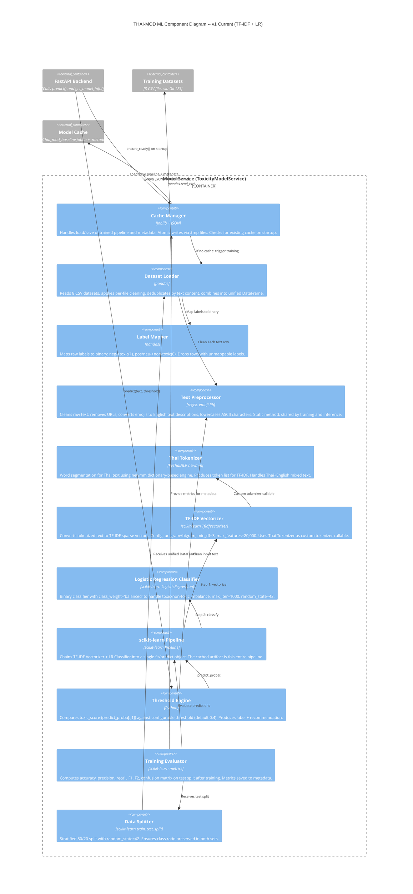

# C4 Level 3: ML Component Diagram -- v1 Current (TF-IDF + Logistic Regression)

> Zooms into the **Model Service** container from the Level 2 diagram.
> Shows the internal components of the ML pipeline as currently deployed.

## Diagram



## Component Descriptions

### Cache Manager
- **Responsibility**: Decides whether to load an existing model or trigger training
- **Startup flow**:
  1. Check if `models/thai_mod_baseline.joblib` AND `.metadata.json` exist
  2. If yes: `joblib.load()` the pipeline, parse metadata JSON -> return bundle with `cache_status: "loaded_from_cache"`
  3. If no (or load fails): trigger full training pipeline -> save with atomic `.tmp` writes -> return bundle with `cache_status: "trained_and_cached"`
- **Atomic write**: Writes to `.tmp` files first, then `Path.replace()` to prevent corruption on crash

### Dataset Loader
- **Responsibility**: Aggregate 8 heterogeneous CSV datasets into one clean DataFrame
- **Per-dataset steps**:
  1. `pd.read_csv(dataset_file)`
  2. Drop rows with NaN in `category` or `texts`
  3. Apply `preprocess_text()` to each row
  4. Remove empty-string rows after preprocessing
  5. Map labels via Label Mapper
  6. Tag each row with `source` = filename
- **After combining**: `drop_duplicates(subset=["texts"], keep="first")` to prevent data leakage
- **Output**: DataFrame with columns `[texts, category, source]` where category is int (0 or 1)

### Label Mapper
- **Responsibility**: Standardize diverse label schemes to binary
- **Mapping**:
  - `pos` -> `neu` (first, collapse positive into neutral)
  - `neg` -> `1` (toxic)
  - `neu` -> `0` (non-toxic)
- **Drops**: Rows where category is NaN after mapping (labels that do not fit the scheme)
- **Rationale**: Different datasets use different label names; this normalizes them all

### Text Preprocessor
- **Responsibility**: Clean raw text identically for training and inference (prevents train-serve skew)
- **Steps** (in order):
  1. Handle NaN input -> return empty string
  2. Cast to string
  3. Remove HTTP/HTTPS URLs via regex
  4. Remove www.* URLs via regex
  5. Convert emojis to English text descriptions via `emoji.demojize(text, language="en")`
  6. Lowercase ASCII characters only (Thai characters unchanged)
- **Implementation**: Static method on `ToxicityModelService`
- **Critical invariant**: Same function used in `_prepare_dataset()` (training) and `predict()` (inference)

### Thai Tokenizer
- **Responsibility**: Word segmentation for Thai text
- **Engine**: PyThaiNLP `word_tokenize` with `newmm` (dictionary-based maximum matching)
- **Post-processing**: Filter out empty strings and whitespace-only tokens
- **Handles**: Thai, English, and mixed Thai-English (code-switching) text
- **Integration**: Passed as `tokenizer` parameter to TfidfVectorizer (replaces default regex tokenizer)

### TF-IDF Vectorizer
- **Responsibility**: Convert tokenized text into numerical feature vectors
- **Configuration**:
  - `tokenizer`: Thai Tokenizer (PyThaiNLP newmm)
  - `token_pattern`: None (disabled, using custom tokenizer)
  - `ngram_range`: (1, 2) -- unigrams and bigrams
  - `min_df`: 3 -- ignore terms appearing in fewer than 3 documents
  - `max_features`: 20,000 -- vocabulary cap
- **Output**: Sparse matrix of TF-IDF weights

### Logistic Regression Classifier
- **Responsibility**: Binary classification (toxic vs non-toxic)
- **Configuration**:
  - `class_weight`: 'balanced' -- automatically adjusts weights inversely proportional to class frequencies, addressing the 74/26 imbalance
  - `max_iter`: 1000 -- sufficient for convergence
  - `random_state`: 42 -- reproducibility
- **Output**: Probability estimates via `predict_proba()` (used by Threshold Engine)

### scikit-learn Pipeline
- **Responsibility**: Chain vectorizer + classifier into a single object
- **Steps**: `[("vect", TfidfVectorizer(...)), ("clf", LogisticRegression(...))]`
- **Benefit**: Single `.fit()` and `.predict_proba()` call. The cached artifact IS this pipeline.

### Threshold Engine
- **Responsibility**: Convert probability to actionable moderation decision
- **Logic**:
  - `toxic_score = pipeline.predict_proba([processed_text])[0][1]`
  - If `toxic_score >= threshold`: label="toxic", recommendation="FLAG_FOR_REVIEW"
  - Else: label="non-toxic", recommendation="ALLOW"
  - `confidence = toxic_score` if predicted toxic, else `1.0 - toxic_score`
- **Default threshold**: 0.4 (lower than standard 0.5 to favor recall)
- **Caller can override**: threshold is a parameter on every predict call

### Training Evaluator
- **Responsibility**: Compute metrics after training for metadata storage
- **Metrics computed**:
  - `accuracy_score`
  - `precision_score`
  - `recall_score`
  - `f1_score`
  - `fbeta_score(beta=2)` (F2 -- recall-weighted)
  - `confusion_matrix`
  - `test_size` (number of test samples)
- **Note**: Evaluation uses threshold-based predictions (not argmax), consistent with inference behavior

### Data Splitter
- **Responsibility**: Create reproducible train/test split
- **Config**: `test_size=0.2`, `random_state=42`, `stratify=y`
- **Stratification**: Ensures toxic/non-toxic ratio (~26/74) is preserved in both splits

## Training Flow (detailed)

```
[Startup: ensure_ready()]
    |
    v
[Cache Manager] -- cache exists? --YES--> joblib.load() --> READY
    |
    NO
    v
[Dataset Loader]
    |-- Read dataset1.csv ... dataset8.csv
    |-- Per file: dropna -> preprocess -> filter empty -> label map -> tag source
    |-- Concat all -> deduplicate by text
    |
    v
[Data Splitter]
    |-- stratified split: 80% train, 20% test
    |
    v
[Pipeline.fit(X_train, y_train)]
    |-- TF-IDF Vectorizer: fit_transform (builds vocabulary, computes IDF)
    |   |-- Thai Tokenizer: segment each text
    |-- LR Classifier: fit (learn weights with balanced class penalty)
    |
    v
[Training Evaluator]
    |-- predict_proba(X_test) with default threshold
    |-- Compute: accuracy, precision, recall, F1, F2, confusion matrix
    |
    v
[Cache Manager]
    |-- Save pipeline to .joblib.tmp -> rename to .joblib
    |-- Save metadata to .json.tmp -> rename to .json
    |
    v
READY (cache_status: "trained_and_cached")
```

## Inference Flow (detailed)

```
[API: predict(text="...", threshold=0.4)]
    |
    v
[Threshold Engine]
    |
    v
[Preprocessor]
    |-- Remove URLs
    |-- Demojize emojis
    |-- Lowercase ASCII
    |
    v
[Pipeline.predict_proba([processed_text])]
    |
    v
[TF-IDF Vectorizer.transform]
    |-- [Thai Tokenizer] segment text
    |-- Look up tokens in learned vocabulary
    |-- Compute TF-IDF weights
    |
    v
[LR Classifier.predict_proba]
    |-- Apply learned weights
    |-- Return [P(non-toxic), P(toxic)]
    |
    v
[Threshold Engine]
    |-- toxic_score = P(toxic)
    |-- toxic_score >= 0.4? -> "toxic" / "FLAG_FOR_REVIEW"
    |--                   else -> "non-toxic" / "ALLOW"
    |-- confidence = max(toxic_score, 1-toxic_score)
    |
    v
[Return PredictionResult]
    {text, processed_text, predicted_label, toxic_score,
     confidence, threshold, recommendation, source_model}
```

## Performance Characteristics (v1)

| Metric | Value |
|---|---|
| Accuracy | 83.0% |
| Precision (toxic) | 78% |
| Recall (toxic) | 77.6% (balanced) / 81% (threshold 0.3) |
| F1 | 79% |
| F2 | ~79% |
| Inference latency (CPU) | ~0.5-1 ms per request |
| Model file size | ~5-20 MB |
| RAM usage | ~50-200 MB |
| Vocabulary size | up to 20,000 features |
