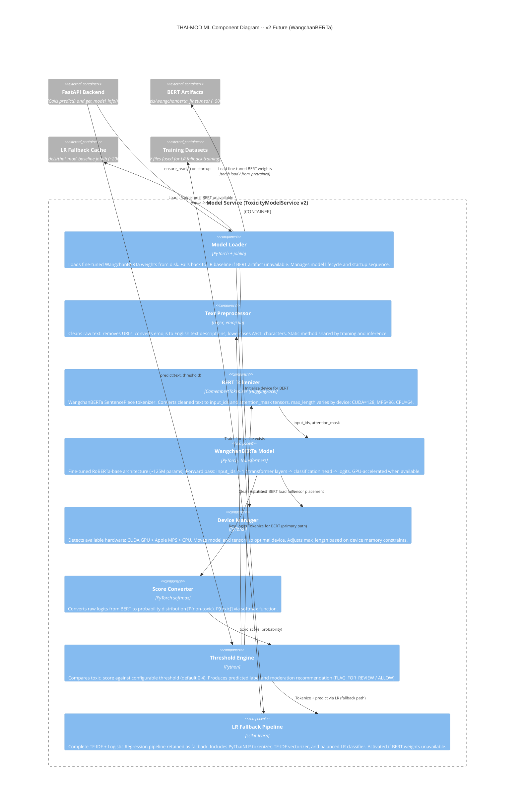

# C4 Level 3: ML Component Diagram -- v2 Future (WangchanBERTa)

> Zooms into the **Model Service** container from the v2 Level 2 diagram.
> Shows the internal components of the ML pipeline with WangchanBERTa transformer inference.

## Diagram



## Component Descriptions

### Model Loader
- **Responsibility**: Manages model lifecycle and startup sequence
- **Startup flow**:
  1. Check for BERT artifact at `models/wangchanberta_finetuned/`
  2. If found: load model + tokenizer via HuggingFace `from_pretrained()`, initialize Device Manager, move model to optimal device
  3. If not found or load error: activate LR Fallback Pipeline
  4. Report `deployment_mode`: `"transformer_inference"` or `"cached_startup_baseline"`
- **Guarantees**: The system always starts. The fallback chain ensures at least LR is available.

### Text Preprocessor
- **Responsibility**: Clean raw text identically for training and inference (prevents train-serve skew)
- **Steps** (in order):
  1. Handle NaN input -> return empty string
  2. Cast to string
  3. Remove HTTP/HTTPS URLs via regex
  4. Remove www.* URLs via regex
  5. Convert emojis to English text descriptions via `emoji.demojize(text, language="en")`
  6. Lowercase ASCII characters only (Thai characters unchanged)
- **Critical invariant**: Same function used across all model types (BERT and LR)

### BERT Tokenizer (CamembertTokenizer)
- **Type**: SentencePiece subword tokenizer (WangchanBERTa uses CamemBERT/RoBERTa architecture)
- **Input**: Cleaned text string from preprocessor
- **Output**: `input_ids` and `attention_mask` tensors
- **max_length by device**:
  - CUDA GPU: 128 tokens
  - Apple MPS: 96 tokens
  - CPU: 64 tokens (shorter to limit inference time on slow hardware)
- **Padding**: `padding="max_length"` with `truncation=True`
- **Subword advantage**: Handles unknown words (new slang, misspellings) by splitting into known subword pieces, unlike word-level tokenizers that would treat them as out-of-vocabulary

### WangchanBERTa Model
- **Architecture**: RoBERTa-base with sequence classification head (2 output classes)
- **Parameters**: ~125M
- **Pre-trained on**: Thai social media text (WangchanBERTa base model by AI Research Institute of Thailand)
- **Fine-tuned on**: Project's 8 datasets, binary toxic/non-toxic classification
- **Training config** (from thai-bert.ipynb):
  - Optimizer: AdamW
  - Learning rate: 2e-5 with linear warmup scheduler
  - Epochs: 3
  - Gradient clipping: max_norm=1.0
  - Loss: CrossEntropyLoss
  - Batch size: varies by device memory
- **Inference mode**: `model.eval()` + `torch.no_grad()` context for speed and memory efficiency
- **Output**: Raw logits tensor [logit_non_toxic, logit_toxic]

### Device Manager
- **Responsibility**: Hardware detection and tensor management
- **Detection order**:
  1. `torch.cuda.is_available()` -> CUDA GPU (fastest)
  2. `torch.backends.mps.is_available()` -> Apple Silicon MPS
  3. Fallback -> CPU
- **Impact on performance**:

| Device | Inference latency | Throughput | max_length |
|---|---|---|---|
| CUDA GPU (T4) | ~3-5 ms | ~200-300 req/s | 128 |
| Apple MPS (M-series) | ~8-15 ms | ~70-120 req/s | 96 |
| CPU (8-core) | ~45-70 ms | ~15-20 req/s | 64 |

### Score Converter
- **Responsibility**: Convert BERT logits to calibrated probability
- **Method**: `torch.softmax(logits, dim=1)[:, 1]` extracts P(toxic) as a float 0.0-1.0
- **Equivalent to**: `predict_proba()[:, 1]` in scikit-learn (same interface for Threshold Engine)
- **Calibration note**: Softmax probabilities from fine-tuned BERT are reasonably calibrated for threshold-based decisions but not perfectly calibrated; Platt scaling could be applied for improvement

### Threshold Engine
- **Responsibility**: Convert probability to actionable moderation decision
- **Logic**:
  - `toxic_score` from Score Converter (BERT path) or `predict_proba` (LR fallback)
  - If `toxic_score >= threshold`: label="toxic", recommendation="FLAG_FOR_REVIEW"
  - Else: label="non-toxic", recommendation="ALLOW"
  - `confidence = toxic_score` if toxic, else `1.0 - toxic_score`
- **Default threshold**: 0.4 (lower than 0.5 to favor recall, reducing false negatives)
- **Configurable**: Threshold is a parameter on every predict call; moderator can adjust via UI slider

### LR Fallback Pipeline
- **Contains**: Complete v1 ML pipeline as a single scikit-learn Pipeline object
  - PyThaiNLP Tokenizer (newmm engine)
  - TF-IDF Vectorizer (unigram+bigram, max 20k features)
  - Logistic Regression (class_weight='balanced')
- **Activated when**: BERT artifact not found or load fails
- **Behavior**: Identical to the v1 deployed system
- **Purpose**: Zero-downtime guarantee; system always serves predictions regardless of BERT availability

## Inference Flow: BERT Primary Path

```
[API: predict(text="โคตร toxic เลย report มันไป", threshold=0.4)]
    |
    v
[Text Preprocessor]
    |-- Remove URLs -> (none found)
    |-- Demojize emojis -> (none found)
    |-- Lowercase ASCII -> "โคตร toxic เลย report มันไป"
    |
    v
[BERT Tokenizer (CamembertTokenizer)]
    |-- SentencePiece encode: split into subword tokens
    |-- Add special tokens: [CLS] ... [SEP]
    |-- Pad/truncate to max_length (e.g., 128 on CUDA)
    |-- Output: input_ids=[5, 1823, 7, 4521, ...], attention_mask=[1, 1, 1, 1, ...]
    |
    v
[Device Manager] -> move input tensors to GPU (if available)
    |
    v
[WangchanBERTa Model]
    |-- model.eval(), torch.no_grad()
    |-- Forward pass through 12 transformer layers + classification head
    |-- Output: logits = [-1.2, 2.8]
    |
    v
[Score Converter]
    |-- softmax([-1.2, 2.8]) -> [0.018, 0.982]
    |-- toxic_score = 0.982
    |
    v
[Threshold Engine]
    |-- 0.982 >= 0.4 -> label="toxic", recommendation="FLAG_FOR_REVIEW"
    |-- confidence = 0.982
    |
    v
[Return PredictionResult]
    {text: "โคตร toxic เลย report มันไป",
     processed_text: "โคตร toxic เลย report มันไป",
     predicted_label: "toxic",
     toxic_score: 0.982,
     confidence: 0.982,
     threshold: 0.4,
     recommendation: "FLAG_FOR_REVIEW",
     source_model: "WangchanBERTa (fine-tuned)"}
```

## Inference Flow: LR Fallback Path

```
[BERT artifact not found at startup]
    |
    v
[Model Loader] -> log warning -> activate LR Fallback Pipeline
    |
    v
[API: predict(text, threshold)]
    |
    v
[Text Preprocessor] -> same cleaning as BERT path
    |
    v
[LR Fallback Pipeline]
    |-- PyThaiNLP Tokenizer: word segment Thai text
    |-- TF-IDF Vectorizer: look up tokens, compute TF-IDF
    |-- LR Classifier: predict_proba -> [P(non-toxic), P(toxic)]
    |-- toxic_score = P(toxic)
    |
    v
[Threshold Engine] -> same logic as BERT path
    |
    v
[Return PredictionResult with source_model: "TF-IDF + Logistic Regression (Balanced)"]
```

## Model Startup Sequence

```
[App startup: ensure_ready()]
    |
    v
[Model Loader]
    |-- Check models/wangchanberta_finetuned/ exists?
    |
    |-- YES:
    |   |-- Load tokenizer: CamembertTokenizer.from_pretrained(path)
    |   |-- Load model: CamembertForSequenceClassification.from_pretrained(path)
    |   |-- [Device Manager] detect hardware -> move model to device
    |   |-- model.eval()
    |   |-- deployment_mode = "transformer_inference"
    |   |-- READY
    |
    |-- NO:
    |   |-- Check models/thai_mod_baseline.joblib exists?
    |   |
    |   |-- YES:
    |   |   |-- joblib.load(pipeline)
    |   |   |-- deployment_mode = "cached_startup_baseline"
    |   |   |-- READY
    |   |
    |   |-- NO:
    |       |-- Train LR from 8 datasets
    |       |-- Save to joblib + metadata JSON
    |       |-- deployment_mode = "trained_and_cached"
    |       |-- READY
```

## Performance Characteristics

| Metric | Value |
|---|---|
| Accuracy | 89.1% |
| Macro F1 | 85.7% |
| Toxic Recall | ~78-80% (estimated from macro F1) |
| Inference (CUDA GPU) | ~3-5 ms per request |
| Inference (Apple MPS) | ~8-15 ms per request |
| Inference (CPU) | ~45-70 ms per request |
| Model file size | ~500 MB |
| RAM usage | ~1.3-1.5 GB |
| Cold-start time | 6-15s |
| Parameters | ~125M |
| Context understanding | Full bidirectional attention across entire input sequence |
| Sarcasm/slang handling | Strong (contextual embeddings from Thai social media pre-training) |
| Code-switching | Strong (shared SentencePiece vocab handles Thai+English naturally) |
