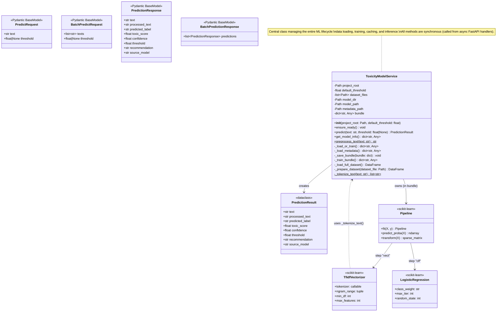
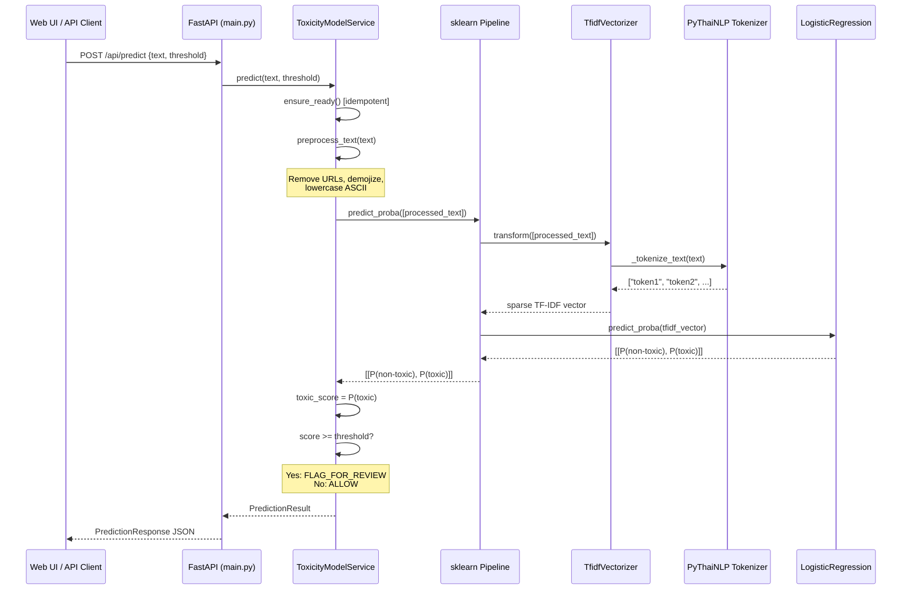
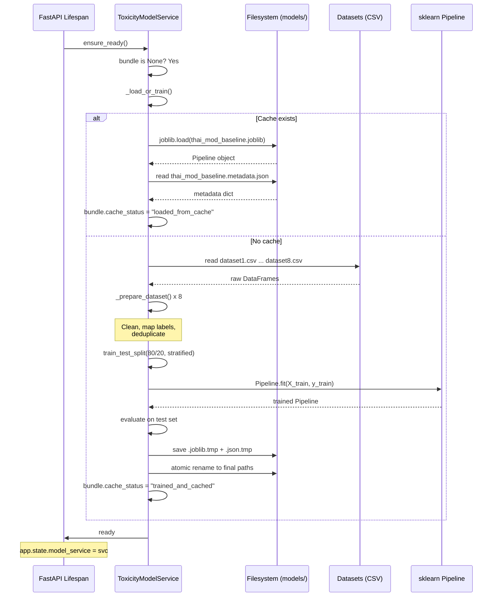

# C4 Level 4: Code-level Diagram -- Model Service

> Zooms into the **Model Service** component to show class structure, method signatures, and data flow at the code level.
> Based on the actual implementation in `src/thai_mod_api/model_service.py`.

## Class Diagram



## Method Detail

### `__init__(project_root, default_threshold=0.4)`

```
Sets up paths and configuration. No model loading happens here.

Attributes initialized:
  project_root       -> root of the repository (2 levels up from main.py)
  default_threshold  -> 0.4 (recall-favoring default)
  dataset_files      -> [datasets/dataset1.csv, ..., datasets/dataset8.csv]
  model_dir          -> models/ (created if not exists)
  model_path         -> models/thai_mod_baseline.joblib
  metadata_path      -> models/thai_mod_baseline.metadata.json
  bundle             -> None (loaded lazily)
```

### `ensure_ready()`

```
Called once during app startup (FastAPI lifespan).
If bundle is None: triggers _load_or_train().
Idempotent: safe to call multiple times.

Flow:
  bundle is None? --YES--> _load_or_train() --> assign to self.bundle
                  --NO---> return (already ready)
```

### `_load_or_train() -> dict`

```
Decision point: load cached model or train from scratch.

Flow:
  model_path exists AND metadata_path exists?
    |
    YES --> try:
    |         joblib.load(model_path) -> pipeline
    |         _load_metadata() -> metadata dict
    |         return bundle with cache_status="loaded_from_cache"
    |       except:
    |         fall through to training
    |
    NO/FAIL --> _train_bundle() -> bundle
                _save_bundle(bundle)
                bundle["cache_status"] = "trained_and_cached"
                return bundle
```

### `_train_bundle() -> dict`

```
Full training pipeline from raw CSV to evaluated model.

Steps:
  1. _load_full_dataset() -> DataFrame [texts, category, source]

  2. train_test_split(X, y, test_size=0.2, random_state=42, stratify=y)

  3. Build Pipeline:
     Pipeline([
       ("vect", TfidfVectorizer(
           tokenizer=_tokenize_text,    # PyThaiNLP newmm
           token_pattern=None,          # disable default regex
           ngram_range=(1, 2),          # unigrams + bigrams
           min_df=3,                    # ignore rare terms
           max_features=20_000          # vocabulary cap
       )),
       ("clf", LogisticRegression(
           class_weight="balanced",     # handle 74/26 imbalance
           max_iter=1000,
           random_state=42
       ))
     ])

  4. pipeline.fit(X_train, y_train)

  5. Evaluate on test set WITH threshold:
     probabilities = pipeline.predict_proba(X_test)[:, 1]
     predictions = (probabilities >= default_threshold).astype(int)
     Compute: accuracy, precision, recall, F1, F2, confusion_matrix

  6. Return bundle dict:
     {pipeline, model_name, deployment_mode, default_threshold,
      trained_at (UTC ISO), dataset_rows, dataset_sources, metrics}
```

### `_load_full_dataset() -> DataFrame`

```
Aggregates all 8 datasets into one clean DataFrame.

Flow:
  for each dataset_file in dataset_files:
    _prepare_dataset(file) -> per-file DataFrame
  pd.concat(all frames)
  drop_duplicates(subset=["texts"], keep="first")
  reset_index

Output columns: [texts: str, category: int(0|1), source: str]
```

### `_prepare_dataset(dataset_file) -> DataFrame`

```
Cleans and normalizes a single CSV dataset.

Steps:
  1. pd.read_csv(dataset_file)
  2. dropna(subset=["category", "texts"])
  3. Apply preprocess_text() to "texts" column
  4. Remove rows where texts is empty after preprocessing
  5. Label mapping:
     "pos" -> "neu"  (collapse positive into neutral)
     "neg" -> 1      (toxic)
     "neu" -> 0      (non-toxic)
  6. dropna(subset=["category"]) (remove unmappable labels)
  7. Cast category to int
  8. Add source column = filename (e.g., "dataset1.csv")
  9. Return DataFrame[texts, category, source]
```

### `preprocess_text(text) -> str` [static]

```
Text cleaning function. MUST be identical for training and inference.

Steps:
  1. if pd.isna(text): return ""
  2. cleaned = str(text)
  3. Remove HTTP(S) URLs:
     re.sub(r"http[s]?://...", "", cleaned)
  4. Remove www URLs:
     re.sub(r"www\\..*", "", cleaned)
  5. Emoji to text:
     emoji.demojize(cleaned, language="en")
  6. Lowercase ASCII only:
     for each char: lower() if ord(char) < 128, else keep original
  7. Return cleaned string

Example:
  Input:  "ไอ้บ้า 😡 https://t.co/abc THIS IS TOXIC"
  Output: "ไอ้บ้า :enraged_face:  this is toxic"
```

### `_tokenize_text(text) -> list[str]` [static]

```
Thai word segmentation. Used as custom tokenizer for TfidfVectorizer.

Steps:
  1. word_tokenize(str(text), engine="newmm")
     - newmm = dictionary-based maximum matching algorithm
     - Handles Thai, English, and mixed text
  2. Filter: remove empty strings and whitespace-only tokens
  3. Return list of token strings

Example:
  Input:  "โคตร toxic เลย"
  Output: ["โคตร", "toxic", "เลย"]
```

### `predict(text, threshold=None) -> PredictionResult`

```
Single text inference. Main entry point for API.

Steps:
  1. ensure_ready() (idempotent)
  2. effective_threshold = threshold or self.default_threshold
  3. processed_text = preprocess_text(text)
  4. toxic_score = pipeline.predict_proba([processed_text])[0][1]
  5. predicted_toxic = int(toxic_score >= effective_threshold)
  6. confidence = toxic_score if predicted_toxic else (1.0 - toxic_score)
  7. Return PredictionResult:
     - text: original input
     - processed_text: cleaned version
     - predicted_label: "toxic" or "non-toxic"
     - toxic_score: float (0.0 - 1.0), rounded to 4 decimals
     - confidence: float, rounded to 4 decimals
     - threshold: effective threshold used
     - recommendation: "FLAG_FOR_REVIEW" or "ALLOW"
     - source_model: bundle["model_name"]
```

### `get_model_info() -> dict`

```
Returns model metadata for /api/model-info and /api/health.

Returns:
  {model_name, deployment_mode, cache_status, default_threshold,
   trained_at, dataset_rows, dataset_sources, metrics}
```

### `_save_bundle(bundle)`

```
Atomic save of trained model + metadata.

Steps:
  1. Extract metadata dict from bundle (excludes pipeline object)
  2. Write pipeline to .joblib.tmp via joblib.dump()
  3. Write metadata to .json.tmp via json.dump()
  4. Atomic rename: .tmp -> final path (Path.replace)

Why atomic: prevents corrupted files if process crashes mid-write.
```

## Bundle Structure (internal state)

```python
self.bundle = {
    "pipeline":         Pipeline,          # scikit-learn Pipeline (TF-IDF + LR)
    "model_name":       str,               # "TF-IDF + Logistic Regression (Balanced)"
    "deployment_mode":  str,               # "cached_startup_baseline" | "trained_and_cached"
    "default_threshold": float,            # 0.4
    "trained_at":       str,               # ISO 8601 UTC timestamp
    "dataset_rows":     int,               # total rows after dedup
    "dataset_sources":  list[str],         # ["dataset1.csv", ..., "dataset8.csv"]
    "metrics": {
        "accuracy":         float,
        "precision":        float,
        "recall":           float,
        "f1_score":         float,
        "f2_score":         float,
        "confusion_matrix": list[list[int]],  # [[TN, FP], [FN, TP]]
        "test_size":        int
    },
    "cache_status":     str                # "loaded_from_cache" | "trained_and_cached"
}
```

## Sequence Diagram: Single Prediction



## Sequence Diagram: App Startup



## File Dependencies

```
src/thai_mod_api/
    main.py
        imports: model_service.ToxicityModelService
        imports: schemas.PredictRequest, PredictionResponse, ...
        creates: ToxicityModelService(PROJECT_ROOT)
        lifespan: model_service.ensure_ready()

    model_service.py
        imports: joblib, pandas, sklearn.*, pythainlp, emoji, re
        defines: PredictionResult (dataclass)
        defines: ToxicityModelService (main class)
        reads: datasets/dataset*.csv (training)
        reads/writes: models/thai_mod_baseline.* (cache)

    schemas.py
        imports: pydantic.BaseModel
        defines: PredictRequest, BatchPredictRequest
        defines: PredictionResponse, BatchPredictionResponse

    static/
        index.html  -> served at GET /
        admin.html  -> served at GET /admin
        app.js      -> moderator UI logic, calls /api/predict
        admin.js    -> admin UI logic, calls /api/health, /api/model-info
        styles.css  -> shared styles
```
