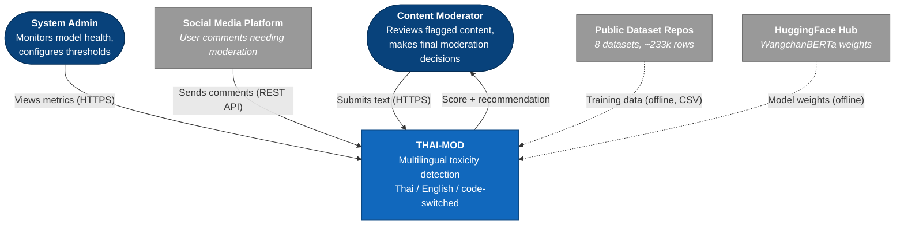
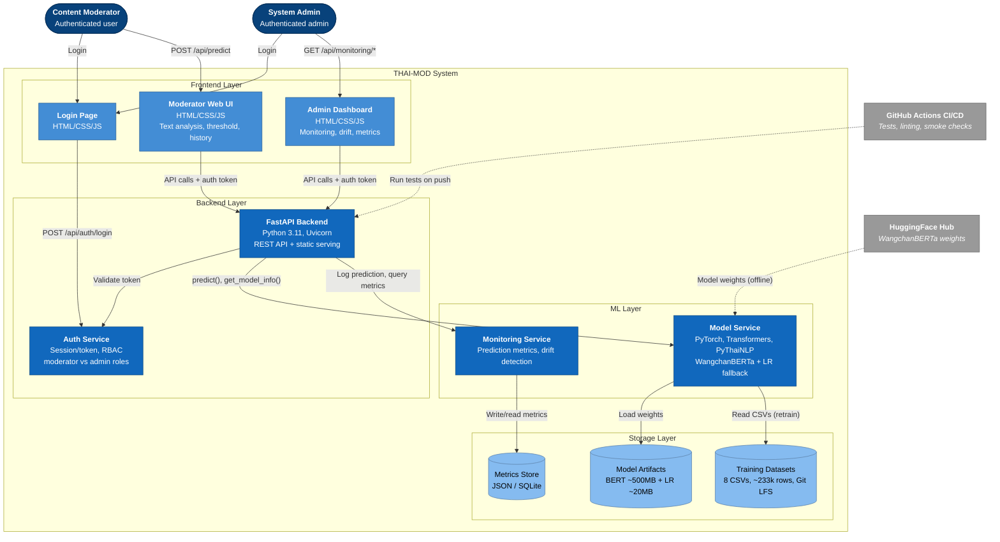
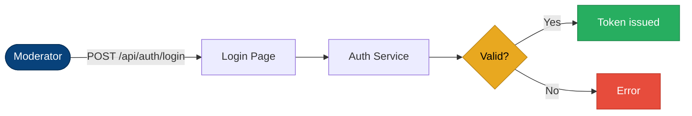
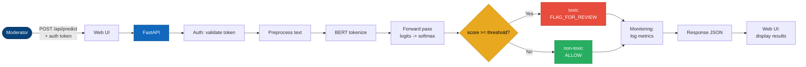
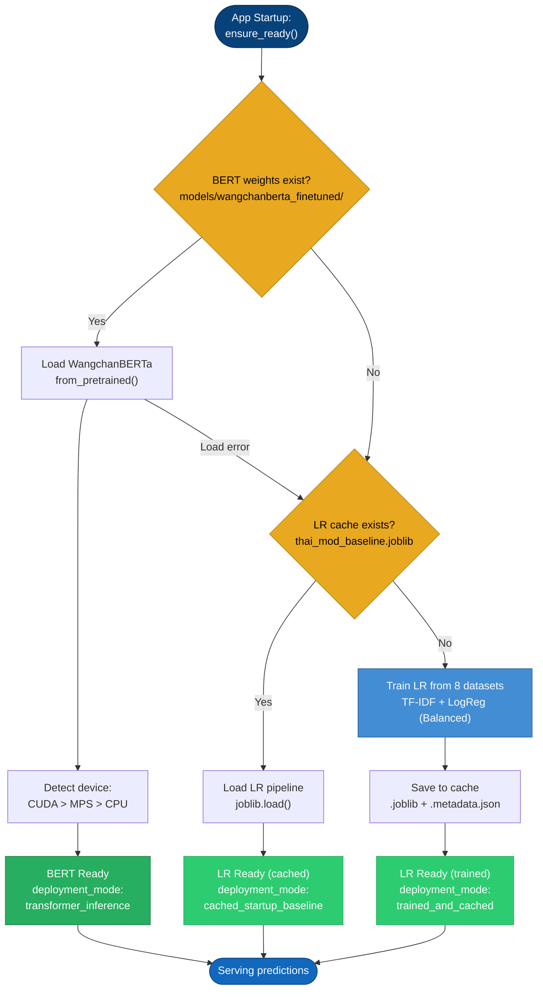
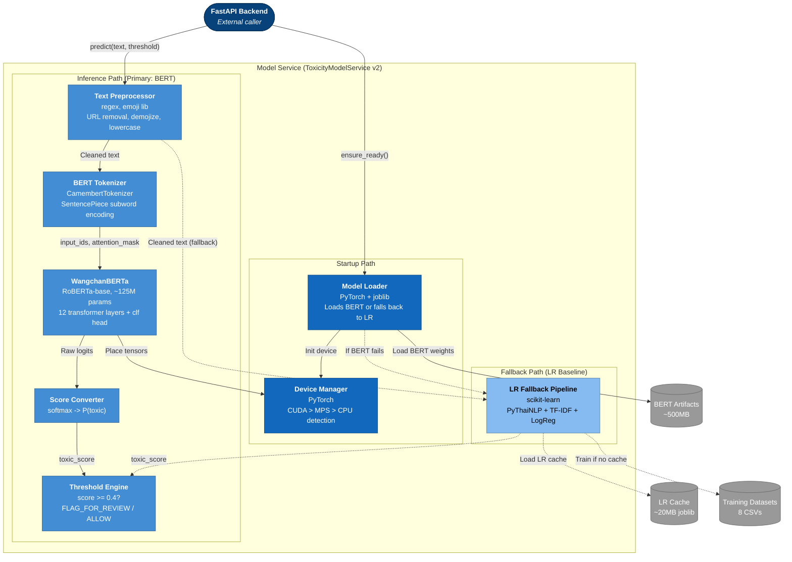
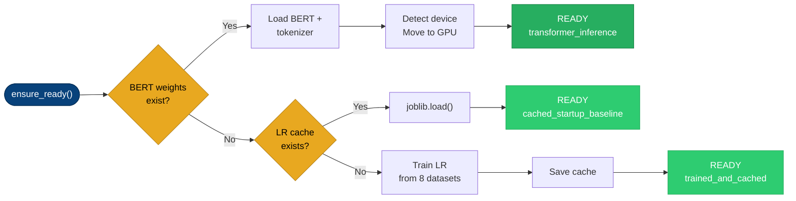
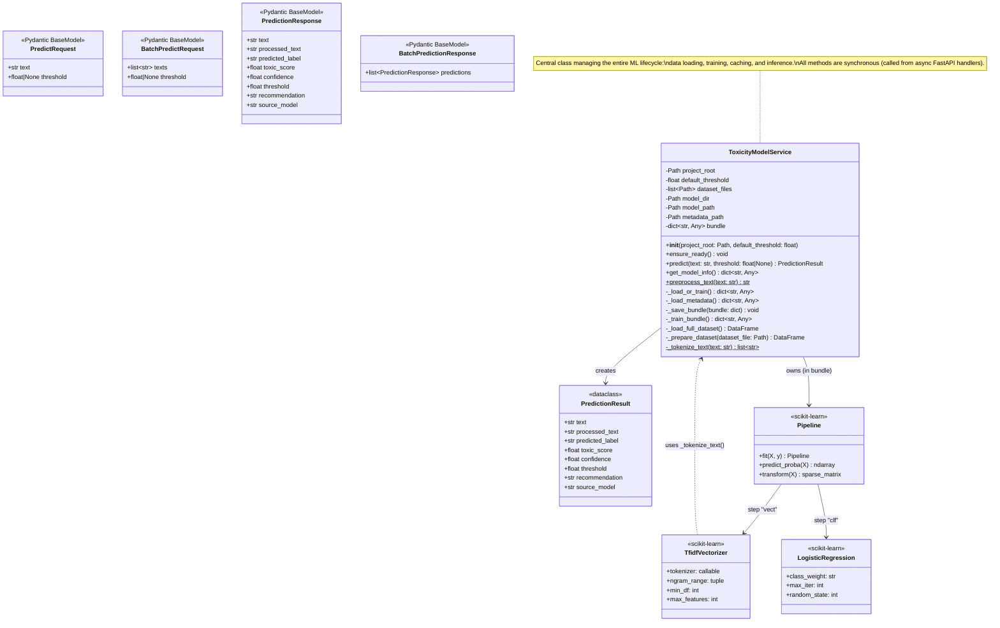
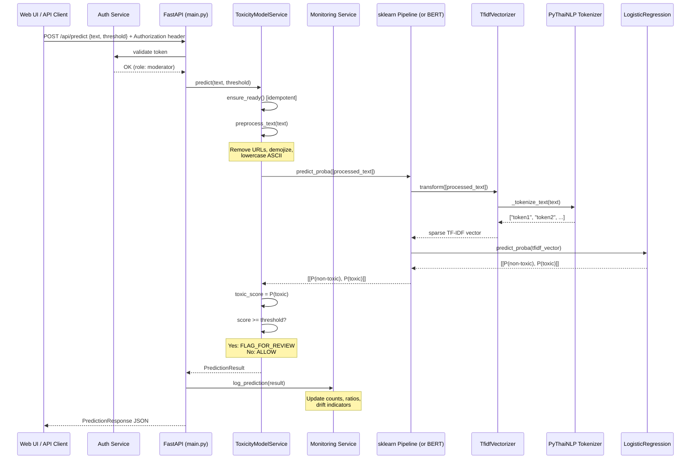
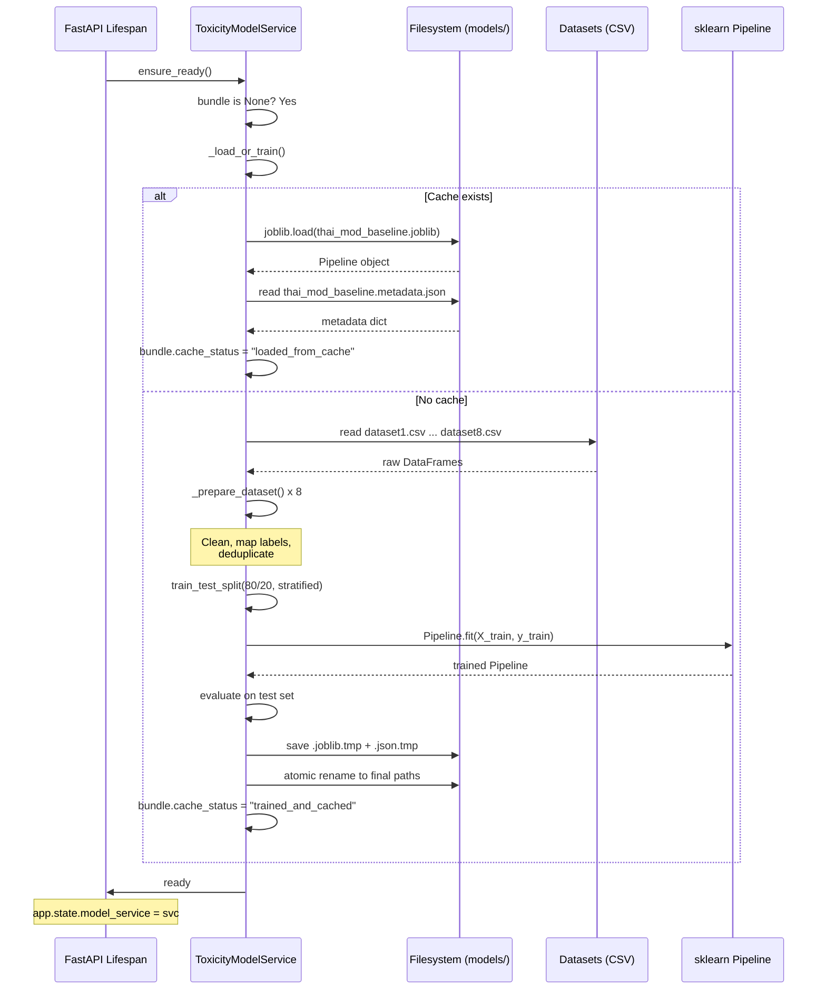

# THAI-MOD v2 Architecture: Complete C4 Reference

**System**: THAI-MOD -- Multilingual Online Toxicity Detection System
**Version**: v2 Future State
**Primary model**: WangchanBERTa (fine-tuned transformer, ~125M params) with TF-IDF + Logistic Regression fallback
**Includes**: Authentication, monitoring, CI/CD pipeline

This document covers all four C4 levels in a single reference:
- Level 1: System Context -- scope, users, external systems
- Level 2: Container Diagram -- all deployable units within the system boundary
- Level 3: Component Diagram -- internals of the Model Service (ML pipeline)
- Level 4: Code-level Diagram -- class structure, method signatures, sequence diagrams

---

## Level 1: System Context

### Diagram



### Actor Descriptions

#### Content Moderator (Primary User)

The main user of the system. Receives flagged comments with toxicity scores and recommendations and makes the final decision on whether to allow, remove, or escalate content. The system is explicitly designed as decision-support, not automated enforcement. Interacts through the Moderator Web UI at `/`. In v2 the moderator must authenticate before accessing predictions.

#### System Administrator

Monitors model health via `/api/health` and `/api/model-info`. Views prediction metrics and cache status through the Admin UI at `/admin`. In v2: manages authentication, reviews monitoring dashboards showing prediction trends and drift indicators, and can trigger model retraining.

#### Social Media Platform (External)

The upstream source of user-generated content. Sends individual comments or batches to THAI-MOD's REST API for screening. In the prototype this is simulated by manual input through the Moderator UI.

#### Public Dataset Repositories (External)

8 labeled datasets from academic and open-source sources used during training only, never at inference time:

- Thai datasets (5): Wisesight Sentiment, Thai Toxicity Tweet, HateThaiSent, Thai Sentiment Analysis, Thai Cyberbullying LGBT
- English datasets (3): Jigsaw Toxic Comment, Hate Speech for Social Media, Hate Speech and Offensive Language
- Combined: ~233,931 rows pre-dedup, ~30,620 post-dedup

#### Pre-trained Model Hub (External)

Hugging Face Hub provides WangchanBERTa transformer weights. Used offline during model fine-tuning; downloaded once and cached locally. At runtime, the system loads these cached weights from the local filesystem -- no network call is made during inference.

### Key Boundaries

| Boundary | Inside | Outside |
|---|---|---|
| System boundary | THAI-MOD API, Moderator UI, ML model, preprocessing pipeline, auth, monitoring | Social platforms, dataset repos, model hubs |
| Trust boundary | Moderator (authenticated), Admin (authenticated with elevated role) | External API consumers |
| Data boundary | Processed text + predictions (ephemeral, not stored as raw text) | Raw user data stays on the originating platform |

### Privacy Notes

- THAI-MOD processes text in real-time and does not store user comments permanently
- No PII is collected or retained
- All training data comes from publicly available, anonymized datasets
- The system is designed as human-in-the-loop: it flags, it does not enforce
- Monitoring logs store only numerical features (score, text length, language tag) -- raw text is never persisted

---

## Level 2: Container Diagram

### Diagram



### Container Descriptions

#### Login Page

- Served at: `GET /login`
- Features: Username/password form, role selection (moderator/admin), error feedback
- Flow: On successful login, redirects to Moderator UI or Admin Dashboard based on role

#### Auth Service

- Responsibility: Authentication and authorization
- Method: Session/token-based (lightweight, demo-friendly)
- Roles:
  - `moderator`: Access to Moderator UI and prediction endpoints
  - `admin`: Access to everything including monitoring endpoints
- Demo credentials: Pre-configured accounts for live presentation
- Integration: FastAPI middleware validates token on protected routes before each handler runs

#### Moderator Web UI

- Location: `src/thai_mod_api/static/index.html` + `app.js` + `styles.css`
- Served at: `GET /` (requires authentication)
- Features:
  - Text input for single-message analysis
  - Adjustable toxicity threshold slider
  - Pre-loaded sample inputs for demo
  - Result cards: predicted label, toxic score, confidence, threshold, recommendation
  - Recent prediction history panel
- Auth: Sends auth token with every API call

#### Admin Dashboard UI

- Location: `src/thai_mod_api/static/admin.html` + `admin.js`
- Served at: `GET /admin` (requires admin role)
- Features:
  - Model health status and metadata display
  - Evaluation metrics: accuracy, precision, recall, F1, F2, confusion matrix
  - Monitoring dashboard:
    - Prediction count over time
    - Toxic/non-toxic ratio trend
    - Average toxicity score trend
    - Text length distribution
    - Data drift indicators

#### FastAPI Backend

- Location: `src/thai_mod_api/main.py`
- Framework: FastAPI with Uvicorn ASGI server
- Middleware: Auth validation on all protected routes, restricted CORS policy

| Method | Path | Purpose | Auth |
|---|---|---|---|
| GET | `/` | Serve Moderator UI | Moderator+ |
| GET | `/admin` | Serve Admin Dashboard | Admin |
| GET | `/login` | Serve Login Page | Public |
| POST | `/api/auth/login` | Authenticate, return token | Public |
| POST | `/api/auth/logout` | Invalidate session | Authenticated |
| GET | `/api/health` | Health check | Authenticated |
| GET | `/api/model-info` | Full model metadata | Authenticated |
| POST | `/api/predict` | Single text prediction | Moderator+ |
| POST | `/api/batch-predict` | Batch prediction (up to 100) | Moderator+ |
| GET | `/api/monitoring/summary` | Prediction metrics summary | Admin |
| GET | `/api/monitoring/drift` | Drift detection results | Admin |
| GET | `/api/monitoring/timeline` | Metrics over time | Admin |

#### Model Service (ToxicityModelService)

- Location: `src/thai_mod_api/model_service.py`
- Primary model: WangchanBERTa (fine-tuned, ~125M params)
- Fallback model: TF-IDF + Logistic Regression (Balanced)
- Pipeline:
  1. Load WangchanBERTa weights from `models/wangchanberta_finetuned/`
  2. Detect hardware (CUDA > MPS > CPU), move model to device
  3. On predict: preprocess -> BERT tokenize -> forward pass -> softmax -> threshold -> recommendation
  4. If BERT unavailable: automatically fall back to LR baseline
- Default threshold: 0.4

#### Monitoring Service

- Responsibility: Track system behavior and detect degradation
- Metrics tracked:
  - Total prediction count
  - Toxic/non-toxic prediction ratio
  - Average toxicity score
  - Average text length
  - Language distribution (Thai / English / mixed)
- Drift detection: Statistical tests comparing recent input distribution against training distribution
- Alerts: Flags when metrics deviate beyond configured thresholds
- Storage: Writes to Metrics Store

#### Metrics Store

- Format: JSON files or lightweight SQLite database
- Content: Anonymized prediction logs (no raw text stored), aggregated metrics, drift detection history
- Privacy: Text content is not persisted; only numerical features (score, length, language tag) are logged

#### Model Artifacts

- Location: `models/` directory (gitignored)
- BERT files: `models/wangchanberta_finetuned/` (~500MB) -- PyTorch model weights + tokenizer config
- LR files: `models/thai_mod_baseline.joblib` (~20MB) + `.metadata.json` -- fallback artifact
- Metadata: Training timestamp, dataset info, evaluation metrics, deployment mode

#### Training Datasets

- Location: `datasets/dataset1.csv` through `dataset8.csv`
- Tracking: Git LFS
- Size: ~233k rows raw, ~30k after deduplication
- Used: During training/retraining only, not at inference time

#### GitHub Actions CI/CD

- Trigger: On push / pull request
- Pipeline:
  1. Install dependencies (`pip install -r requirements.txt`)
  2. Run unit tests (preprocessing, label mapping, API contracts)
  3. Run API smoke tests (health endpoint, predict endpoint)
  4. Linting checks

### Data Flow: Authenticated Prediction

**Step 1: Authentication**



**Step 2: Prediction (with token)**



### Model Fallback Strategy

The Model Service implements a three-level fallback chain to ensure zero-downtime operation:



### API Schema

Request and response schemas are stable and maintain backward compatibility with v1 consumers:

- `PredictRequest`: `{text: str, threshold?: float}`
- `PredictionResponse`: `{text, processed_text, predicted_label, toxic_score, confidence, threshold, recommendation, source_model}`
- `BatchPredictRequest`: `{texts: [str], threshold?: float}`
- `BatchPredictionResponse`: `{predictions: [PredictionResponse]}`

### Infrastructure Requirements

| Dimension | Specification |
|---|---|
| Python | 3.11+ (conda env: cedt) |
| Key dependencies | FastAPI, PyTorch, Transformers, scikit-learn, PyThaiNLP, emoji |
| RAM at runtime | ~1.5-2 GB (BERT loaded) |
| Disk for models | ~520 MB (BERT ~500MB + LR fallback ~20MB) |
| GPU | Recommended (CUDA or MPS) for <10ms inference; CPU viable at ~50-70ms |
| Cold-start time | 6-15s (BERT weight loading) |
| Inference latency | ~3-5ms (GPU) / ~50-70ms (CPU) per request |

---

## Level 3: ML Component Diagram

This level zooms into the Model Service container and shows the internal components of the ML pipeline with WangchanBERTa transformer inference.

### Diagram



### Component Descriptions

#### Model Loader

- Responsibility: Manages model lifecycle and startup sequence
- Startup flow:
  1. Check for BERT artifact at `models/wangchanberta_finetuned/`
  2. If found: load model + tokenizer via HuggingFace `from_pretrained()`, initialize Device Manager, move model to optimal device
  3. If not found or load error: activate LR Fallback Pipeline
  4. Report `deployment_mode`: `"transformer_inference"` or `"cached_startup_baseline"`
- Guarantees: The system always starts. The fallback chain ensures at least LR is available.

#### Text Preprocessor

- Responsibility: Clean raw text identically for training and inference (prevents train-serve skew)
- Steps (in order):
  1. Handle NaN input -> return empty string
  2. Cast to string
  3. Remove HTTP/HTTPS URLs via regex
  4. Remove www.* URLs via regex
  5. Convert emojis to English text descriptions via `emoji.demojize(text, language="en")`
  6. Lowercase ASCII characters only (Thai characters unchanged)
- Critical invariant: Same function used across all model types (BERT and LR)

#### BERT Tokenizer (CamembertTokenizer)

- Type: SentencePiece subword tokenizer (WangchanBERTa uses CamemBERT/RoBERTa architecture)
- Input: Cleaned text string from preprocessor
- Output: `input_ids` and `attention_mask` tensors
- max_length by device:
  - CUDA GPU: 128 tokens
  - Apple MPS: 96 tokens
  - CPU: 64 tokens (shorter to limit inference time on slow hardware)
- Padding: `padding="max_length"` with `truncation=True`
- Subword advantage: Handles unknown words (new slang, misspellings) by splitting into known subword pieces, unlike word-level tokenizers that would treat them as out-of-vocabulary

#### WangchanBERTa Model

- Architecture: RoBERTa-base with sequence classification head (2 output classes)
- Parameters: ~125M
- Pre-trained on: Thai social media text (WangchanBERTa base model by AI Research Institute of Thailand)
- Fine-tuned on: Project's 8 datasets, binary toxic/non-toxic classification
- Training config (from thai-bert.ipynb):
  - Optimizer: AdamW
  - Learning rate: 2e-5 with linear warmup scheduler
  - Epochs: 3
  - Gradient clipping: max_norm=1.0
  - Loss: CrossEntropyLoss
  - Batch size: varies by device memory
- Inference mode: `model.eval()` + `torch.no_grad()` context for speed and memory efficiency
- Output: Raw logits tensor [logit_non_toxic, logit_toxic]

#### Device Manager

- Responsibility: Hardware detection and tensor management
- Detection order:
  1. `torch.cuda.is_available()` -> CUDA GPU (fastest)
  2. `torch.backends.mps.is_available()` -> Apple Silicon MPS
  3. Fallback -> CPU

| Device | Inference latency | Throughput | max_length |
|---|---|---|---|
| CUDA GPU (T4) | ~3-5 ms | ~200-300 req/s | 128 |
| Apple MPS (M-series) | ~8-15 ms | ~70-120 req/s | 96 |
| CPU (8-core) | ~45-70 ms | ~15-20 req/s | 64 |

#### Score Converter

- Responsibility: Convert BERT logits to calibrated probability
- Method: `torch.softmax(logits, dim=1)[:, 1]` extracts P(toxic) as a float 0.0-1.0
- Equivalent to: `predict_proba()[:, 1]` in scikit-learn (same interface for Threshold Engine)
- Calibration note: Softmax probabilities from fine-tuned BERT are reasonably calibrated for threshold-based decisions but not perfectly calibrated; Platt scaling could be applied for improvement

#### Threshold Engine

- Responsibility: Convert probability to actionable moderation decision
- Logic:
  - `toxic_score` from Score Converter (BERT path) or `predict_proba` (LR fallback)
  - If `toxic_score >= threshold`: label="toxic", recommendation="FLAG_FOR_REVIEW"
  - Else: label="non-toxic", recommendation="ALLOW"
  - `confidence = toxic_score` if toxic, else `1.0 - toxic_score`
- Default threshold: 0.4 (lower than 0.5 to favor recall, reducing false negatives)
- Configurable: Threshold is a parameter on every predict call; moderator can adjust via UI slider

#### LR Fallback Pipeline

- Contains: Complete v1 ML pipeline as a single scikit-learn Pipeline object
  - PyThaiNLP Tokenizer (newmm engine)
  - TF-IDF Vectorizer (unigram+bigram, max 20k features)
  - Logistic Regression (class_weight='balanced')
- Activated when: BERT artifact not found or load fails
- Behavior: Identical to the v1 deployed system
- Purpose: Zero-downtime guarantee; system always serves predictions regardless of BERT availability

### Inference Flow: BERT Primary Path

**Example input**: `"โคตร toxic เลย report มันไป"` (threshold=0.4)

```mermaid
graph LR
    A["API: predict()"] --> B["Preprocessor<br/>Remove URLs, demojize,<br/>lowercase ASCII"]
    B -- '"โคตร toxic เลย report มันไป"' --> C["BERT Tokenizer<br/>SentencePiece encode<br/>+ pad to max_length"]
    C -- "input_ids, attention_mask" --> D["Device Manager<br/>Move to GPU"]
    D --> E["WangchanBERTa<br/>12 layers + clf head<br/>logits: [-1.2, 2.8]"]
    E --> F["Softmax<br/>[0.018, 0.982]<br/>toxic_score = 0.982"]
    F --> G{"0.982 >= 0.4?"}
    G -- "Yes" --> H["toxic<br/>FLAG_FOR_REVIEW<br/>confidence: 0.982"]

    style A fill:#1168bd,stroke:#0b4884,color:#fff
    style G fill:#e8a820,stroke:#b8841a,color:#000
    style H fill:#e74c3c,stroke:#c0392b,color:#fff
```

### Inference Flow: LR Fallback Path


### Model Startup Sequence



### Performance Characteristics

| Metric | Value |
|---|---|
| Accuracy | 89.1% |
| Macro F1 | 85.7% |
| Toxic Recall | ~78-80% (estimated from macro F1) |
| Inference (CUDA GPU) | ~3-5 ms per request |
| Inference (Apple MPS) | ~8-15 ms per request |
| Inference (CPU) | ~45-70 ms per request |
| Model file size | ~500 MB |
| RAM usage | ~1.3-1.5 GB |
| Cold-start time | 6-15s |
| Parameters | ~125M |
| Context understanding | Full bidirectional attention across entire input sequence |
| Sarcasm/slang handling | Strong (contextual embeddings from Thai social media pre-training) |
| Code-switching | Strong (shared SentencePiece vocab handles Thai+English naturally) |

---

## Level 4: Code-level Diagram

This level zooms into the Model Service implementation and shows class structure, method signatures, internal state, and data flow at the code level. Based on `src/thai_mod_api/model_service.py`.

### Class Diagram



### Method Signatures and Behavior

#### `__init__(project_root, default_threshold=0.4)`

```
Sets up paths and configuration. No model loading happens here.

Attributes initialized:
  project_root       -> root of the repository (2 levels up from main.py)
  default_threshold  -> 0.4 (recall-favoring default)
  dataset_files      -> [datasets/dataset1.csv, ..., datasets/dataset8.csv]
  model_dir          -> models/ (created if not exists)
  model_path         -> models/thai_mod_baseline.joblib
  metadata_path      -> models/thai_mod_baseline.metadata.json
  bundle             -> None (loaded lazily)
```

#### `ensure_ready()`

```
Called once during app startup (FastAPI lifespan).
If bundle is None: triggers _load_or_train().
Idempotent: safe to call multiple times.

Flow:
  bundle is None? --YES--> _load_or_train() --> assign to self.bundle
                  --NO---> return (already ready)
```

#### `_load_or_train() -> dict`

```
Decision point: load cached model or train from scratch.

Flow:
  model_path exists AND metadata_path exists?
    |
    YES --> try:
    |         joblib.load(model_path) -> pipeline
    |         _load_metadata() -> metadata dict
    |         return bundle with cache_status="loaded_from_cache"
    |       except:
    |         fall through to training
    |
    NO/FAIL --> _train_bundle() -> bundle
                _save_bundle(bundle)
                bundle["cache_status"] = "trained_and_cached"
                return bundle
```

#### `_train_bundle() -> dict`

```
Full training pipeline from raw CSV to evaluated model.

Steps:
  1. _load_full_dataset() -> DataFrame [texts, category, source]

  2. train_test_split(X, y, test_size=0.2, random_state=42, stratify=y)

  3. Build Pipeline:
     Pipeline([
       ("vect", TfidfVectorizer(
           tokenizer=_tokenize_text,    # PyThaiNLP newmm
           token_pattern=None,          # disable default regex
           ngram_range=(1, 2),          # unigrams + bigrams
           min_df=3,                    # ignore rare terms
           max_features=20_000          # vocabulary cap
       )),
       ("clf", LogisticRegression(
           class_weight="balanced",     # handle 74/26 imbalance
           max_iter=1000,
           random_state=42
       ))
     ])

  4. pipeline.fit(X_train, y_train)

  5. Evaluate on test set WITH threshold:
     probabilities = pipeline.predict_proba(X_test)[:, 1]
     predictions = (probabilities >= default_threshold).astype(int)
     Compute: accuracy, precision, recall, F1, F2, confusion_matrix

  6. Return bundle dict:
     {pipeline, model_name, deployment_mode, default_threshold,
      trained_at (UTC ISO), dataset_rows, dataset_sources, metrics}
```

#### `_load_full_dataset() -> DataFrame`

```
Aggregates all 8 datasets into one clean DataFrame.

Flow:
  for each dataset_file in dataset_files:
    _prepare_dataset(file) -> per-file DataFrame
  pd.concat(all frames)
  drop_duplicates(subset=["texts"], keep="first")
  reset_index

Output columns: [texts: str, category: int(0|1), source: str]
```

#### `_prepare_dataset(dataset_file) -> DataFrame`

```
Cleans and normalizes a single CSV dataset.

Steps:
  1. pd.read_csv(dataset_file)
  2. dropna(subset=["category", "texts"])
  3. Apply preprocess_text() to "texts" column
  4. Remove rows where texts is empty after preprocessing
  5. Label mapping:
     "pos" -> "neu"  (collapse positive into neutral)
     "neg" -> 1      (toxic)
     "neu" -> 0      (non-toxic)
  6. dropna(subset=["category"]) (remove unmappable labels)
  7. Cast category to int
  8. Add source column = filename (e.g., "dataset1.csv")
  9. Return DataFrame[texts, category, source]
```

#### `preprocess_text(text) -> str` [static]

```
Text cleaning function. MUST be identical for training and inference.

Steps:
  1. if pd.isna(text): return ""
  2. cleaned = str(text)
  3. Remove HTTP(S) URLs:
     re.sub(r"http[s]?://...", "", cleaned)
  4. Remove www URLs:
     re.sub(r"www\\..*", "", cleaned)
  5. Emoji to text:
     emoji.demojize(cleaned, language="en")
  6. Lowercase ASCII only:
     for each char: lower() if ord(char) < 128, else keep original
  7. Return cleaned string

Example:
  Input:  "ไอ้บ้า 😡 https://t.co/abc THIS IS TOXIC"
  Output: "ไอ้บ้า :enraged_face:  this is toxic"
```

#### `_tokenize_text(text) -> list[str]` [static]

```
Thai word segmentation. Used as custom tokenizer for TfidfVectorizer.

Steps:
  1. word_tokenize(str(text), engine="newmm")
     - newmm = dictionary-based maximum matching algorithm
     - Handles Thai, English, and mixed text
  2. Filter: remove empty strings and whitespace-only tokens
  3. Return list of token strings

Example:
  Input:  "โคตร toxic เลย"
  Output: ["โคตร", "toxic", "เลย"]
```

#### `predict(text, threshold=None) -> PredictionResult`

```
Single text inference. Main entry point for API.

Steps:
  1. ensure_ready() (idempotent)
  2. effective_threshold = threshold or self.default_threshold
  3. processed_text = preprocess_text(text)
  4. toxic_score = pipeline.predict_proba([processed_text])[0][1]
  5. predicted_toxic = int(toxic_score >= effective_threshold)
  6. confidence = toxic_score if predicted_toxic else (1.0 - toxic_score)
  7. Return PredictionResult:
     - text: original input
     - processed_text: cleaned version
     - predicted_label: "toxic" or "non-toxic"
     - toxic_score: float (0.0 - 1.0), rounded to 4 decimals
     - confidence: float, rounded to 4 decimals
     - threshold: effective threshold used
     - recommendation: "FLAG_FOR_REVIEW" or "ALLOW"
     - source_model: bundle["model_name"]
```

#### `get_model_info() -> dict`

```
Returns model metadata for /api/model-info and /api/health.

Returns:
  {model_name, deployment_mode, cache_status, default_threshold,
   trained_at, dataset_rows, dataset_sources, metrics}
```

#### `_save_bundle(bundle)`

```
Atomic save of trained model + metadata.

Steps:
  1. Extract metadata dict from bundle (excludes pipeline object)
  2. Write pipeline to .joblib.tmp via joblib.dump()
  3. Write metadata to .json.tmp via json.dump()
  4. Atomic rename: .tmp -> final path (Path.replace)

Why atomic: prevents corrupted files if process crashes mid-write.
```

### Bundle Structure (Internal State)

```python
self.bundle = {
    "pipeline":         Pipeline,          # scikit-learn Pipeline (TF-IDF + LR)
    "model_name":       str,               # "TF-IDF + Logistic Regression (Balanced)"
    "deployment_mode":  str,               # "cached_startup_baseline" | "trained_and_cached"
    "default_threshold": float,            # 0.4
    "trained_at":       str,               # ISO 8601 UTC timestamp
    "dataset_rows":     int,               # total rows after dedup
    "dataset_sources":  list[str],         # ["dataset1.csv", ..., "dataset8.csv"]
    "metrics": {
        "accuracy":         float,
        "precision":        float,
        "recall":           float,
        "f1_score":         float,
        "f2_score":         float,
        "confusion_matrix": list[list[int]],  # [[TN, FP], [FN, TP]]
        "test_size":        int
    },
    "cache_status":     str                # "loaded_from_cache" | "trained_and_cached"
}
```

### Sequence Diagram: Single Prediction



### Sequence Diagram: App Startup



### File Dependencies

```
src/thai_mod_api/
    main.py
        imports: model_service.ToxicityModelService
        imports: schemas.PredictRequest, PredictionResponse, ...
        imports: auth_service (middleware)
        imports: monitoring_service
        creates: ToxicityModelService(PROJECT_ROOT)
        lifespan: model_service.ensure_ready()

    model_service.py
        imports: joblib, pandas, sklearn.*, pythainlp, emoji, re
        defines: PredictionResult (dataclass)
        defines: ToxicityModelService (main class)
        reads: datasets/dataset*.csv (training)
        reads/writes: models/thai_mod_baseline.* (cache)
        reads/writes: models/wangchanberta_finetuned/ (BERT weights)

    schemas.py
        imports: pydantic.BaseModel
        defines: PredictRequest, BatchPredictRequest
        defines: PredictionResponse, BatchPredictionResponse

    auth_service.py
        defines: token validation, role checking
        used as: FastAPI middleware dependency

    monitoring_service.py
        defines: prediction logging, metric aggregation, drift detection
        reads/writes: metrics store (JSON or SQLite)

    static/
        index.html  -> served at GET /
        admin.html  -> served at GET /admin
        login.html  -> served at GET /login
        app.js      -> moderator UI logic, calls /api/predict
        admin.js    -> admin UI logic, calls /api/health, /api/model-info, /api/monitoring/*
        styles.css  -> shared styles
```
